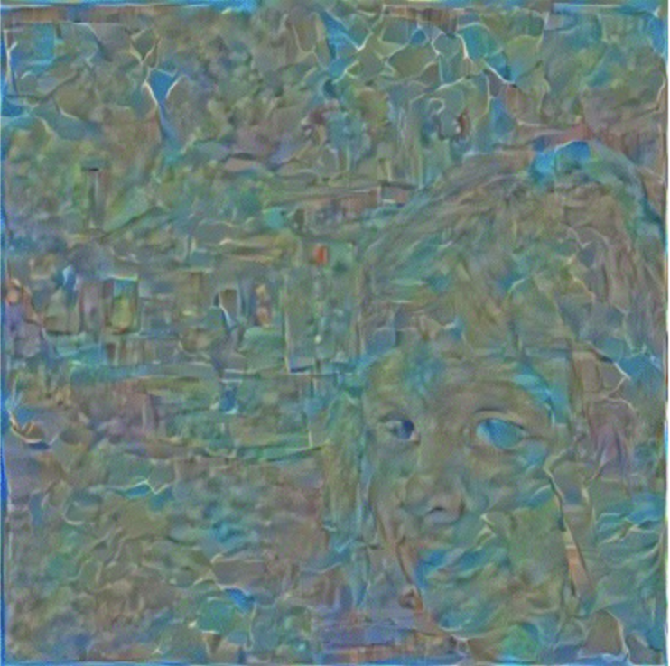
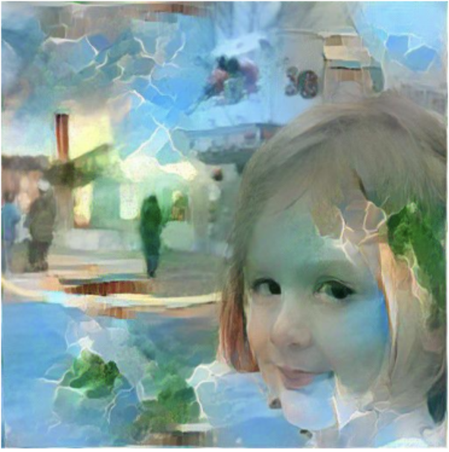

# 🎨 Neural Style Transfer Implementation

This repository implements **Neural Style Transfer**, based on **"A Neural Algorithm of Artistic Style" (Gatys et al., 2015)**. The model applies deep learning techniques to blend the artistic style of one image with the content of another.

## 📌 Features

- Implements **Adam** and **L-BFGS** optimizers for training
- Compares different **initialization strategies** for L-BFGS (random vs. content image)
- Uses **VGG-19** as the feature extractor
- Custom loss functions (`loss.py`), model definitions (`models.py`), and training script (`train.py`)
- 

## 📂 Repository Structure

📦 StyleTransfer_Implementation

┣ 📜 [README.md](http://readme.md/)                # Project documentation

┣ 📜 content_disastergirl.jpg # Content image

┣ 📜 style_hockney.jpg        # Style image

┣ 📜 [loss.py](http://loss.py/)                  # Defines loss functions (content loss, style loss, etc.)

┣ 📜 [models.py](http://models.py/)                # Defines the neural network architecture (VGG-19 based)

┣ 📜 [train.py](http://train.py/)                 # Training script for style transfer

## 🖼️ Style Transfer Results

Below are the final results of the Adam and L-BFGS optimizers with different initialization strategies. 

For the content image, I used the famous meme Disaster Girl(2005), and for the style image, I chose Portrait of an Artist(1973) by David Hockney.

## 🖼️ Content & Style Images  
Below are the images used for style transfer.  

<table>
  <tr>
    <td><b>Content Image (Disaster Girl)</b></td>
    <td><b>Style Image (Portrait of an Artist)</b></td>
  </tr>
  <tr>
    <td></td>
    <td></td>
  </tr>
</table>

### 🔹 Adam Optimizer ((Random Initialization, Learning Rate: 1e-1, epoch 900)

Content Loss: **2.82**
Style Loss: **3.21**
Total Loss: **6.03**

### 🔹 Adam Optimizer (Content Image Initialization, Learning Rate: 1e-1, epoch 900)

  

Content Loss: **1.51**
Style Loss: **1.85**
Total Loss: **3.36**

---

### 🔹 L-BFGS Optimizer (Content Image Initialization, Learning Rate: 1, epoch 200)

Content Loss: **1.30**
Style Loss: **0.88**
Total Loss: **2.18**

---

### 🔹 L-BFGS Optimizer (Random Initialization, Learning Rate: 1, epoch 200)

Content Loss: **1.43**
Style Loss: **0.86**
Total Loss: **2.34**

---

### 🔬 **Observations**

- **L-BFGS converges faster** than Adam, achieving a lower final loss.
- **Content image initialization for L-BFGS** results in a **more stable** and structured stylization.
- **Random initialization with L-BFGS** sometimes produces better artistic effects but can be **unstable**.
- **Using the content image for initialization significantly speeds up convergence**, reducing the number of optimization steps needed.
- **Content image initialization also leads to a lower final loss**, indicating that the optimization process finds a better solution compared to random initialization.

### 🔗 **References**
- **Paper:** *A Neural Algorithm of Artistic Style*, Gatys et al., 2015  
- **Lecture:** *Neural Style Transfer Implementation*, [[AI 실무] AI Research Engineer를 위한 논문 구현 시작하기 with PyTorch] by [화이트박스]  